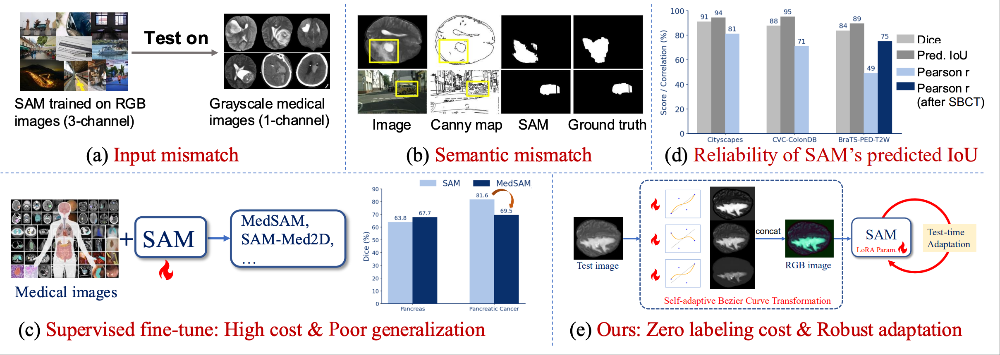
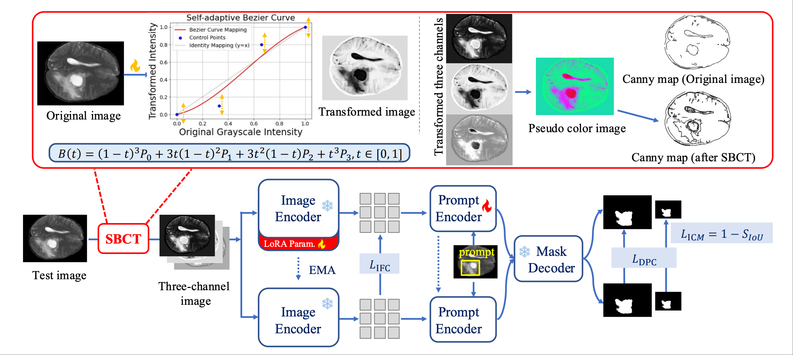

# SAM-TTA: SAM-aware Test-time Adaptation for Universal Medical Image Segmentation

Official implementation of the paper:

**SAM-aware Test-time Adaptation for Universal Medical Image Segmentation**  

📄 [Paper](https://arxiv.org/abs/2506.05221)  
🌐 [Project Page](https://github.com/JianghaoWu/SAM-TTA)

---

## 🔍 Overview

**SAM-TTA** is a lightweight and label-free **test-time adaptation (TTA)** framework that adapts the Segment Anything Model (SAM) to diverse medical imaging domains **without retraining or access to source data**.

While SAM exhibits strong zero-shot generalization on natural images, its direct application to medical images is limited by:

- **Input-level discrepancy**: SAM expects 3-channel RGB images, whereas most medical scans (e.g., CT, MRI) are single-channel grayscale.
- **Semantic-level discrepancy**: Medical targets often have ambiguous boundaries and domain-specific structures, which differ substantially from natural objects.
<p align="center">
  
</p>

To address these challenges, SAM-TTA introduces **input-level adaptation** and **semantic-level alignment** that are optimized *on-the-fly* during inference.

---

## 🧠 Method Overview

<p align="center">
  
</p>


## ✨ Key Features

- **Label-free adaptation**  
  No annotations or source data required at test time

- **Lightweight and efficient**  
  Only a small set of parameters are updated  
  Average adaptation time: **0.364 s per image**

- **Universal applicability**  
  Evaluated on **8 public datasets** covering MRI, CT, and endoscopic images

- **Robust under distribution shift**  
  Consistently outperforms existing TTA methods and, in several OOD settings, even surpasses fully fine-tuned SAM variants

---

## 📊 Quantitative Results (Dice Score, %)

| Method | Pancreas (In-Dist) | Pancreatic Cancer (OOD) | BraTS Average |
|------|-------------------:|------------------------:|--------------:|
| SAM (Zero-shot) | 63.79 | 81.57 | 81.96 |
| MedSAM (Fine-tuned) | 67.71 | 69.50 | 86.36 |
| SAM-Med2D (Fine-tuned) | 79.36 | 73.68 | 77.86 |
| **SAM-TTA (Ours)** | **74.41** | **84.68** | **88.11** |

> SAM-TTA achieves strong and stable improvements across both in-distribution and out-of-distribution scenarios.

---

## 🧪 Evaluated Datasets

- **Brain Tumor Segmentation**
  - BraTS-SSA (T2W, T2-FLAIR)
  - BraTS-PED (T2W, T2-FLAIR)

- **Abdominal Imaging**
  - Pancreas (MRI, AMOS)
  - Pancreatic Cancer (CT, MSWAL)

- **Endoscopic Imaging**
  - CVC-ColonDB
  - Kvasir-SEG

---

## 📂 Code Availability

🚧 **The official code is currently being prepared and will be released soon.**

---

## 📝 Citation

If you find this work useful, please cite:

```bibtex
@article{wu2025samtta,
  title={SAM-aware Test-time Adaptation for Universal Medical Image Segmentation},
  author={Wu, Jianghao and Wu, Yicheng and Xie, Yutong and Bai, Wenjia and Zhang, You and Tang, Feilong and Li, Yulong and Razzak, Imran and Schmidt, Daniel F and George, Yasmeen},
  journal={arXiv:2506.05221},
  year={2025}
}
