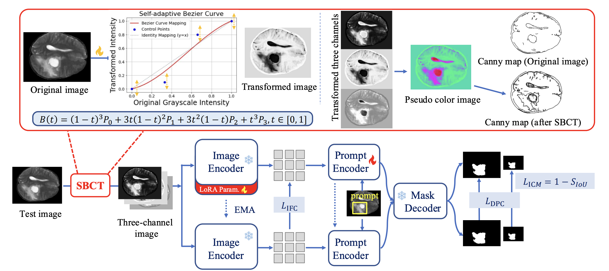

# SAM-TTA: SAM-aware Test-Time Adaptation for Universal Medical Image Segmentation

<div align="center">

[](https://arxiv.org/abs/2506.05221)
<!-- [](https://arxiv.org/abs/2506.05221) -->
[](LICENSE)
[](https://www.python.org/)
[](https://pytorch.org/)

</div>

> **SAM-aware Test-time Adaptation for Universal Medical Image Segmentation**  
> Jianghao Wu, Yicheng Wu*, Yutong Xie, Wenjia Bai, You Zhang, Feilong Tang, Yulong Li, Imran Razzak, Daniel F Schmidt, Yasmeen George  
<!-- > *IEEE Transactions on Image Processing*, 2025 · [arXiv](https://arxiv.org/abs/2506.05221) -->

---

## Overview

SAM-TTA is a lightweight test-time adaptation framework that adapts the [Segment Anything Model (SAM)](https://segment-anything.com/) to medical image segmentation — **without any labeled data, retraining, or access to the source training set**.

<!-- It addresses two fundamental gaps between natural and medical images:

| Challenge | Description | Our Solution |
|-----------|-------------|-------------|
| **Input-level discrepancy** | SAM expects 3-channel RGB; medical scans are single-channel grayscale | **SBCT**: Self-adaptive Bézier Curve-based Transformation |
| **Semantic-level discrepancy** | Ambiguous medical boundaries vs. sharp natural object edges | **IMA**: IoU-guided Multi-scale Adaptation | -->

<div align="center">

<br>
<em>SAM-TTA framework: SBCT converts grayscale inputs into SAM-compatible 3-channel images; IMA uses a teacher–student structure with IoU-weighted losses to align predictions at multiple scales.</em>
</div>

<!-- --- -->

<!-- 
## Method

### Self-adaptive Bézier Curve-based Transformation (SBCT)

SBCT maps a single-channel grayscale image into a SAM-compatible three-channel image via three independent learnable cubic Bézier curves:

$$\hat{X}^{(c)}(h,w) = B(X(h,w);\ \mathbf{P}_c) = \sum_{j=0}^{3} \binom{3}{j} t^j(1-t)^{3-j} P_{c,j}$$

where $t = X(h,w) \in [0,1]$ is the normalized pixel intensity and $P_{c,j} = \sigma(u_{c,j})$ are the learnable control points. **Only 12 scalar parameters** are optimized per test image — making it extremely lightweight.

<div align="center">

<br>
<em>SBCT visualization: each row shows (a) the original input, (b1–b3) three learned intensity-remapped channels, (b4) pseudocolor composite, and (c1/c2) Canny edges before/after SBCT.</em>
</div>

### IoU-guided Multi-scale Adaptation (IMA)

IMA uses a **teacher–student** architecture with three complementary losses:

- **L_ICM** (IoU Confidence Maximization): `1 - S_IoU` — directly maximizes SAM's predicted IoU score for high-confidence outputs
- **L_DPC** (Dual-scale Prediction Consistency): Dice loss between student/teacher masks at both high and low resolution, weighted by IoU confidence
- **L_IFC** (Intermediate Feature Consistency): KL divergence between teacher and student image encoder features

The student model has a LoRA adapter (rank 4) in the image encoder and a trainable prompt encoder. The **mask decoder is frozen** to preserve IoU calibration. The teacher is updated via EMA (α = 0.95). -->

---

## Installation

```bash
git clone https://github.com/JianghaoWu/SAM-TTA.git
cd SAM-TTA
pip install -r requirements.txt
```

### Download SAM Checkpoint

Download the SAM ViT-B checkpoint and place it in `checkpoints/`:

```bash
mkdir -p checkpoints
wget https://dl.fbaipublicfiles.com/segment_anything/sam_vit_b_01ec64.pth -P checkpoints/
```

---

## Datasets

### Dataset Structure

Each dataset requires a CSV file listing image–mask pairs. The expected directory structure is:

```
data/
├── Pancreas/
│   ├── train.csv        # columns: image_path, mask_path
│   ├── val.csv
│   ├── test.csv
│   └── all.csv
└── BraTS_PED_t2w_2D/
    ├── train.csv
    ├── val.csv
    ├── test.csv
    └── all.csv
```

Each CSV row should contain: `relative/path/to/image.nii.gz, relative/path/to/mask.nii.gz`

### Data Sources

We evaluate on eight public datasets:

| Dataset | Modality | Source |
|---------|----------|--------|
| BraTS-PED 2024 (T2W / T2F) | MRI | [BraTS 2024 Challenge](https://www.synapse.org/brats2024) |
| BraTS-SSA 2023 (T2W / T2F) | MRI | [BraTS 2023 Challenge](https://www.synapse.org/brats2023) |
| Pancreas (AMOS 2022) | MRI | [AMOS Challenge](https://amos22.grand-challenge.org/) |
| Pancreatic Cancer (MSWAL) | CT | [MSWAL Dataset](https://github.com/ljwztc/CLIP-Driven-Universal-Model) |
| CVC-ColonDB | Endoscopy | [CVC-ColonDB](http://mv.cvc.uab.es/projects/colon-qa/cvccolondb) |
| Kvasir-SEG | Endoscopy | [Kvasir-SEG](https://datasets.simula.no/kvasir-seg/) |

Please refer to the respective official sources for download and terms of use.

### Our Pre-processed Data

We provide pre-processed 2D slices (NIfTI format) for two datasets used in our experiments. These are shared with permission from the data providers.

| Dataset | Download |
|---------|----------|
| **Pancreas** (AMOS 2022, MRI) | [OneDrive — coming soon](#) |
| **BraTS-PED T2W 2D slices** | [OneDrive — coming soon](#) |

> **Note:** By downloading these files, you agree to comply with the original data usage agreements of the respective challenge organizers. These pre-processed versions are provided solely to facilitate reproducibility of our experiments.

---

## Usage

### Source-only Baseline (no adaptation)

```bash
python methods/adaptation_source.py --cfg configs/config_brats.py --dataset Pancreas --prompt box
python methods/adaptation_source.py --cfg configs/config_brats.py --dataset BraTS_PED_t2w_2D --prompt box
```

### SAM-TTA (our method)

```bash
python methods/adaptation_samtta.py --cfg configs/config_brats.py --dataset Pancreas --prompt box
python methods/adaptation_samtta.py --cfg configs/config_brats.py --dataset BraTS_PED_t2w_2D --prompt box
```

### Mean Teacher Baseline

```bash
python methods/adaptation_mt.py --cfg configs/config_brats.py --dataset Pancreas --prompt box
```

### Arguments

| Argument | Description | Example |
|----------|-------------|---------|
| `--cfg` | Path to config file | `configs/config_brats.py` |
| `--dataset` | Dataset name (must match `base_config.py`) | `Pancreas`, `BraTS_PED_t2w_2D` |
| `--prompt` | Prompt type | `box` or `point` |
| `--gpu_ids` | GPU device IDs | `0` or `0,1` |

### Output

Results are saved to `output/<method>/<dataset>/`:
```
output/samtta/Pancreas/
├── Pancreas-box-pred_masks/      # per-image binary mask PNGs
├── Pancreas-box-test-results.csv # per-image Dice / ASSD / HD95
├── configs/                      # saved YAML config
└── save-ckpt/                    # adapted model checkpoint
```

---

## Configuration

Edit `configs/config_brats.py` or `configs/base_config.py` to customize settings:

```python
config = {
    "gpu_ids": "0",
    "batch_size": 1,
    "opt": {
        "learning_rate": 1e-3,   # LoRA + prompt encoder LR
    },
    "model": {
        "type": "vit_b",         # SAM backbone: vit_b / vit_l / vit_h
    },
}
```

Dataset paths are configured in `configs/base_config.py` under the `datasets` key.

---

## Project Structure

```
SAM-TTA/
├── methods/
│   ├── adaptation_samtta.py    # SAM-TTA (ours)
│   ├── adaptation_source.py    # Source-only baseline
│   ├── adaptation_mt.py        # Mean Teacher baseline
│   └── adaptation_medsam.py    # MedSAM inference baseline
├── utils/
│   ├── nonlinear_net.py        # DynamicBezierTransform2D (SBCT)
│   ├── nonlinear.py            # LearnableBezierTransform (static variant)
│   ├── eval_utils.py           # Metrics: Dice, HD95, ASSD
│   └── tools.py                # EMA update, model copy, etc.
├── datasets/
│   ├── NII_test.py             # NIfTI loader for TTA (main dataset class)
│   ├── ISIC_test.py            # 2D image loader for TTA
│   └── ...
├── segment_anything/           # SAM implementation (ViT-B/L/H)
├── configs/
│   ├── base_config.py          # Global hyperparameters & dataset paths
│   └── config_brats.py         # BraTS-specific overrides
├── losses.py                   # DiceLoss, kl_spatial_per_channel, etc.
├── model.py                    # SAM wrapper (encode / decode)
├── sam_lora.py                 # LoRA adaptation for SAM image encoder
└── requirements.txt
```

---
<!-- 
## Qualitative Results

<div align="center">

<br>
<em>Segmentation comparisons across eight datasets. SAM-TTA recovers fine structural details and avoids the over-/under-segmentation failures of entropy-based TTA methods.</em>
</div>

--- -->

## Citation

If you find SAM-TTA useful in your research, please cite:

```bibtex
@article{wu2025samtta,
  title     = {SAM-aware Test-time Adaptation for Universal Medical Image Segmentation},
  author    = {Wu, Jianghao and Wu, Yicheng and Xie, Yutong and Bai, Wenjia and Zhang, You and
               Tang, Feilong and Li, Yulong and Razzak, Imran and Schmidt, Daniel F and George, Yasmeen},
  journal   = {arXiv},
  year      = {2025},
  note      = {arXiv:2506.05221}
}
```

---

## Acknowledgements

This work was supported by the Commonwealth of Australia under the Medical Research Future Fund (No. NCRI000074). We thank the organizers of BraTS 2023/2024, AMOS 2022, and MSWAL for making their datasets available.

Our code builds on:
- [SAM (Segment Anything)](https://github.com/facebookresearch/segment-anything) — Kirillov et al., ICCV 2023
- [WESAM](https://github.com/Zhang-Haojie/WESAM) — Zhang et al., CVPR 2024
- [LoRA-SAM](https://github.com/JamesQFreeman/Sam_LoRA) — Low-rank adaptation for SAM

---

## License

This project is released under the [MIT License](LICENSE).
